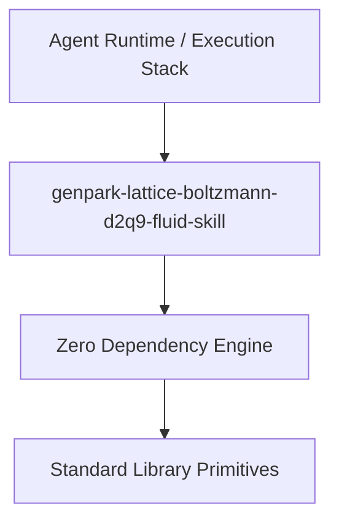

# genpark-lattice-boltzmann-d2q9-fluid-skill

[](https://github.com/alphaparkinc/genpark-lattice-boltzmann-d2q9-fluid-skill)
[](https://github.com/alphaparkinc/genpark-lattice-boltzmann-d2q9-fluid-skill)
[](https://www.python.org/)

2D 9-velocity (D2Q9) Lattice Boltzmann Method (LBM) fluid solver executing BGK collision, periodic streaming, and macroscopic velocity integration.



## Features
- **Strict 0 Pip Dependencies**: Built completely using the Python Standard Library.
- **Fast Execution & Verification**: Includes client wrapper, MCP server, and verified test suites.
- **Agentic AI Ready**: Exposes standard MCP tools for continuous LLM integration.

## Installation & Quickstart
```bash
git clone https://github.com/alphaparkinc/genpark-lattice-boltzmann-d2q9-fluid-skill.git
cd genpark-lattice-boltzmann-d2q9-fluid-skill
python example_usage.py
```
